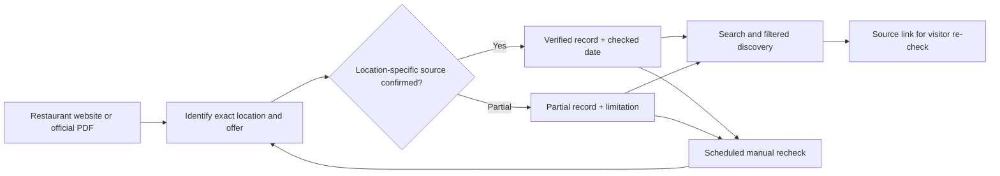

# My Happy Hour | Product and verification case study

**Problem:** Local happy-hour offers change, and sources can differ across restaurant locations. The existing [README](../README.md) describes a focused Vancouver-area prototype and an August 23, 2026 catalogue snapshot; those figures are not a live guarantee that current offers remain valid.

## Source-to-listing workflow

**Status boundary:** A record's last-checked date refers to the time of verification, not to guaranteed availability today. The existing README describes 15 source-linked locations in its dated snapshot, 14 officially verified and one partial; do not present these as up-to-the-minute counts.

## Demonstration and screenshots

No screenshot of the private application is added. Capture only a publicly approved screen using synthetic favorites and public restaurant information, with no private maintenance notes or location analytics. A screenshot of the public [case-study HTML](../index.html) should be labeled as such, not represented as the working app. Do not copy restaurant PDF contents or logos without rights verification.

## Suggested GitHub About fields (not applied)

- **Description:** `Location-aware Vancouver happy-hour discovery prototype with source-linked offers and verification dates.`
- **Topics:** `local-discovery`, `data-curation`, `vancouver`, `web-app`, `source-verification`
- **Homepage:** leave unset until a current, public, permission-cleared application/demo URL has been verified.

The private implementation and internal data-maintenance workflow remain private.