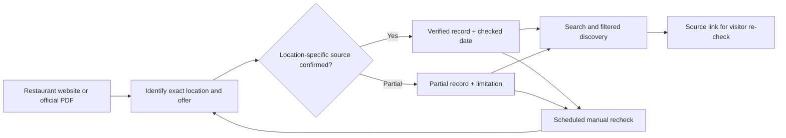

# My Happy Hour | Product and verification case study

**Problem:** Local happy-hour offers change, and sources can differ across restaurant locations. The [README](../README.md) describes a focused Vancouver-area prototype and an **August 23, 2026 catalogue snapshot**; those figures are not a guarantee that current offers remain valid.

## Source-to-listing workflow

## Walkthrough: when an offer changes

This is an **illustrative maintenance example**; it does not assert an actual restaurant changed its prices.

1. Start from the official source for the **specific branch**, not a chain-wide promotion or another location's PDF. Record the source URL, menu identifier and verification date.
2. If a location-specific menu cannot be found, mark that item **partial / verification pending** instead of inventing prices, days or times.
3. If a later source contradicts the stored offer, investigate the effective date and remove any unsupported “current” representation until the discrepancy is resolved.
4. Recheck weekday restrictions, overnight hours, timezone, price and whether the menu describes a dine-in-only promotion. A restaurant's opening hours are **not** by themselves its happy-hour hours.
5. Update the appropriate source record, then confirm search, filters, “open now” and source links display the reviewed information. Keep an auditable date for the next manual recheck.

| Date or state | What visitors can safely infer |
| --- | --- |
| Last checked 2026-08-23 | The working catalogue was reviewed on that date, not that every offer remains valid today. |
| Official-source verified | The documented branch-specific source supported the record **at its check date**. |
| Partial / stale / unverified | Some details require rechecking; do not advertise the offer as confirmed current. |

The README's **15 locations / 14 official-source verified / one partial** are dated snapshot counts, not live inventory metrics.

## Visual demonstration and release checks

No screenshot of the private app is included. For a future authentic image, use approved public restaurant information, fictional favorites, visible **last-checked** dates and links to restaurant-owned sources. Do not reproduce restaurant PDFs or logos without permission; show the real app, not a mock-up. Test mobile search and filtering before claiming a mobile experience is verified. The [HTML case-study page](../index.html) is a narrative showcase, not the application itself.

## GitHub About fields — proposed, not applied

- **Description:** `Location-aware Vancouver happy-hour discovery prototype with source-linked offers and verification dates.`
- **Topics:** `local-discovery`, `data-curation`, `vancouver`, `web-app`, `source-verification`
- **Homepage:** leave unset until a current public, permission-cleared application/demo URL is verified.

The private implementation and internal data-maintenance workflow remain private.